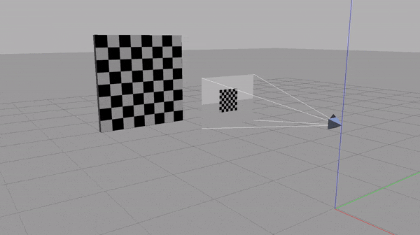

# A View from Gazebo



# Build & Run


```bash
git clone <>
cd <>
./run-gazebo.sh
```

> Wait till `READY` appears on terminal inside container

```bash
(container) mkdir src/build && cd src/build
(container) cmake ..
(container) cmake --build . -j 4 --target install --config Release
(container) gazebo -u camera_calibration_move_model.world --verbose
```

# Development in container with VS Code

Ref: [VS Code: Remote development in Containers](https://code.visualstudio.com/docs/remote/containers-tutorial#_install-the-extension)

## Steps
- Run container using script: `run-gazebo.sh` (keep it running)
- Install [`Remote - Containers` extension](https://marketplace.visualstudio.com/items?itemName=ms-vscode-remote.remote-containers) in VS Code
- From VS Code, attach to a running container:
  - open a remote window: click the status bar item (bottom-left)
  - click `Attach to a running container...`
  - select `gazebo-vm`

- Install extension: [CMake Tools](https://marketplace.visualstudio.com/items?itemName=ms-vscode.cmake-tools)

- Install C/C++ extension: [CppTools](https://marketplace.visualstudio.com/items?itemName=ms-vscode.cpptools)

When working on a C/C++ file, a config file `.vscode/c_cpp_properties.json` will be generated.<br>
Add `"/usr/include/**"` to include path for intellisense.
```
 "includePath": [
                "${workspaceFolder}/**",
                "/usr/include/**"
            ],
```

## CMake
CMake Version used in project is 3.15. [see features](https://cliutils.gitlab.io/modern-cmake/chapters/intro/newcmake.html).
Ref: [An Introduction to Modern CMake](https://cliutils.gitlab.io/modern-cmake/)
